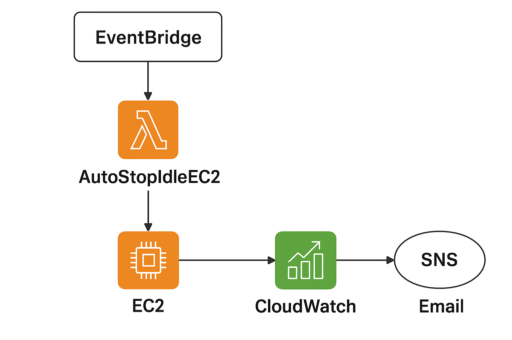

# AWS Cost Optimization Suite 🚀

This project automates AWS cost savings by detecting and managing unused resources.  
It uses AWS Lambda, SNS, CloudWatch, and EventBridge to optimize EC2, EBS, S3, and RDS.

---

## 🔹 Features
- Stop **idle EC2 instances** automatically.
- Detect **unused EBS volumes** and send email alerts.
- Move **old S3 objects** to cheaper storage (`STANDARD_IA`).
- Stop **non-production RDS databases**.
- Publish **CloudWatch custom metrics**.
- Visualize results in a **CloudWatch dashboard**.
- Automated execution via **EventBridge schedule**.

---

## 🔹 Architecture


---

## 🔹 Project Flow
1. **Trigger** → EventBridge (daily at 1AM UTC).
2. **Lambda Execution** → runs optimization logic.
3. **Actions**:
   - Stops idle EC2s.
   - Alerts unused EBS via SNS.
   - Moves old S3 objects.
   - Stops RDS (non-prod).
4. **Metrics** → Published to CloudWatch.
5. **Monitoring** → CloudWatch dashboard shows results.

---

## 🔹 Setup Guide
1. Create IAM role with permissions: EC2, RDS, S3, SNS, CloudWatch.
2. Create SNS topic for cost alerts (subscribe with email).
3. Create S3 bucket for testing.
4. (Optional) Create RDS instance for testing.
5. Deploy Lambda with `lambda_function.py`.
6. Run Lambda manually or via EventBridge schedule.
7. View metrics in CloudWatch dashboard.

---

## 🔹 Example Output
```json
{
  "statusCode": 200,
  "body": {
    "EC2 stopped": ["i-0abcd1234567890"],
    "Unused EBS": ["vol-0abcd1234567890"],
    "S3 moved": ["file1.txt"],
    "RDS stopped": ["testdb"]
  }
}


